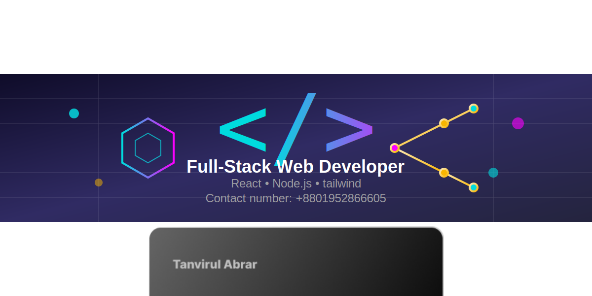

# 👋 Hi, I'm Tanvirul Abrar <Tanvirul Abrar> 
  
🚀 Web Developer | MERN Stack | Frontend-Focused  
🌍 Based in <bd> | Open to Remote Opportunities

# About me
I’m a passionate web developer who enjoys building modern, responsive, and user-friendly web applications. I focus on writing clean code, learning new technologies, and solving real-world problems through software.

---

## 🛠️ Tech Stack

**Frontend**
- HTML5, CSS3, JavaScript (ES6+)
- React.js
- Next.js
- Tailwind CSS 

**Backend**
- Node.js
- Express.js

**Database**
- MongoDB

**Tools & Platforms**
- Git & GitHub
- VS Code
- Vercel / Netlify
- Firebase

---

## 📌 What I Do

- Build responsive and accessible web interfaces
- Develop RESTful APIs
- Integrate frontend with backend services
- Work with authentication & authorization
- Optimize performance and SEO
- Debug and improve existing codebases

---

## 📈 Currently Activities
- I am exploring Next.js
- I’m working on a health care website.

---

## 🤝 Open To

- Internships
- Junior Web Developer roles
- Freelance projects
- Remote opportunities

---

# Social Links
Github: https://github.com/TanvirulAbrar
Linkedin: 

# Relevant GitHub Stats
<!-- Total Contributions -->

<!-- Most Used Languages -->

<!-- Streak Stats -->

