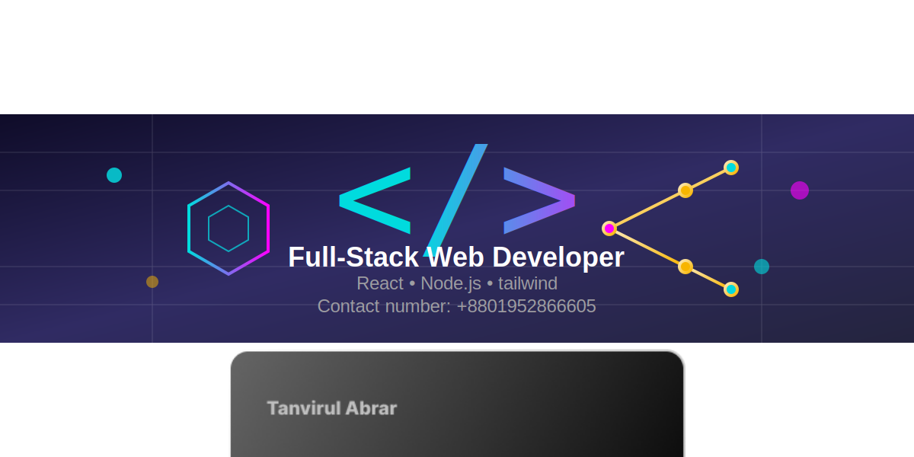

  

#  Hi, I'm Tanvirul Abrar <Tanvirul Abrar> 
  
Web Developer | MERN Stack | Full-stack devloper | Problem solver

#  About me
I’m a passionate web developer who enjoys building modern, responsive, and user-friendly web applications. I focus on writing clean code, learning new technologies, and solving real-world problems through software.

---

##  <b> TECHNOLOGY STACK:</b>  Tech Stack
|       Skills Overview         | Technologies |
|------------------------------ |--------------|
| **Languages**                 |     |
| **CSS Frameworks & Libraries**|  |
| **JavaScript Frameworks & Libraries** |     |
| **Database**                 |  |
| **Deployment Platform**      |   |
| **Design & Graphics**        | |
| **Tools & Technologies**        |   |

---

##  What I Do

- Build responsive and accessible web interfaces
- Develop RESTful APIs
- Integrate frontend with backend services
- Work with authentication & authorization
- Optimize performance and SEO
- Debug and improve existing codebases

---

##  Currently Activities
- I’m working on a real estate websites.
- exploring new tech

---

##  Open To

- Internships
- Junior Web Developer roles
- Freelance projects
- Remote opportunities

---

#  Social Links

#  GitHub Stats

